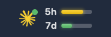
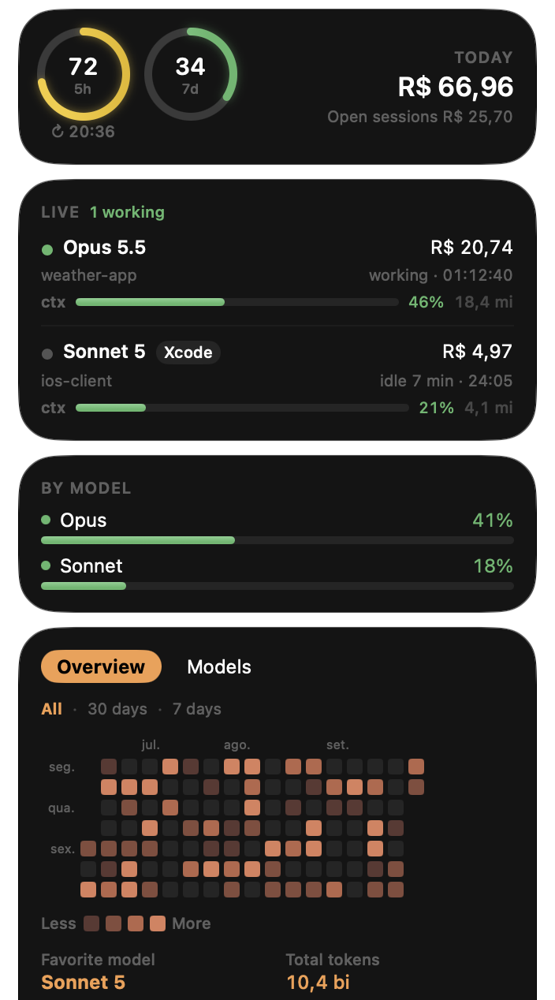

# Claude Status Bar

A macOS menu bar app that shows your Claude usage at a glance: account quota, live sessions, spend and a history that matches Claude Code's `/stats`. Built with SwiftUI and Liquid Glass.

<p align="center">
  <br><br>
  <br>
  <sub>Screenshots use made-up data.</sub>
</p>

The interface follows the macOS language: English, Portuguese (Brazil), Spanish, French or German, with English for any other language. Costs show in the currency of the macOS region (euro in France, Germany or Spain, reais in Brazil, and so on). Anthropic bills in US dollars and your bank converts at its own rate, so converted amounts are market-rate estimates and carry a `≈`; in the US, or when no rate is available, costs stay in exact dollars. Numbers and dates follow the system format.

## What it shows

- **Menu bar**: the Claude mark with two meters for the 5-hour and 7-day quota windows. A green dot pulses while a session is working.
- **Colors as quota runs out**, the same bands as the terminal statusline, used by the menu bar meters and the panel's rings (the Claude mark stays white while all is green, then turns yellow or red too):

  | Usage | Color |
  |---|---|
  | below 70% | green |
  | 70–89% | yellow |
  | 90–100% | red |

- **Quota**: 5h and 7d rings with the reset time, per-model weekly limits when the account reports them, and extra usage.
- **Today**: what you spent today, and what the open sessions cost.
- **Live sessions**: every running Claude Code session, in the terminal or inside Xcode, with model, project, running time, context-window use, working or idle state, tokens and cost. Click a session to open its folder; Option-click opens it in the terminal.
- **History**, like `/stats`:
  - *Overview*: activity heatmap, favorite model, total tokens, sessions, longest session, active days, streaks and busiest day.
  - *Models*: tokens per day by model, with hover, and each model's share with its input, output and cache split.
- **Open at login** and **Quit** buttons in the panel; right-click the icon for Quit as well.

## Where the numbers come from

Everything is read locally except the quota:

| Source | Used for |
|---|---|
| `api.anthropic.com/api/oauth/usage` | 5h/7d quota, per-model limits, extra usage |
| `~/.claude/stats-cache.json` | History up to its last computed day (the file `/stats` reads) |
| `~/.claude/projects/**/*.jsonl` | Today's history and live session context, tokens and activity |
| `~/.claude/metrics/costs.jsonl` | Session cost and today's spend (written by the ECC cost-tracker hook) |
| `ps` / `lsof` | Which Claude Code sessions are running |
| `open.er-api.com` | USD exchange rates, downloaded at most once a day and cached in `~/Library/Caches/com.cesar.claude-status-bar/` |
| `~/.claude/.usd_brl` | USD → BRL rate the terminal statusline caches; used first for reais so both show the same amount |

For the quota, the app uses its own sign-in or reads Claude Code's token from the Keychain item `Claude Code-credentials`. Signing in works like Claude Code's own login: **Sign in with Claude** opens the browser, you click **Authorize**, and the browser hands the login back to the app through a one-time local address (`http://localhost:<port>/callback`, reachable only from your Mac), with nothing to copy. If that can't work, **Paste a code instead** shows a `code#state` to paste. It only reads that item and never refreshes it, so Claude Code stays logged in.

## Requirements

- macOS 14 or later. Liquid Glass needs macOS 26; earlier versions get a material background.
- Swift 6 toolchain (Xcode 16 or the command-line tools).

## Build and install

```sh
make install   # builds macos/build/ClaudeStatusBar.app, copies it to /Applications and opens it
make app       # build the .app only
make test      # run the test suite
make dump      # print sessions, history and quota to the terminal, no UI
```

The build signs the app with your first "Apple Development" certificate, or ad-hoc when there is none. A stable signature keeps the Keychain "Always Allow" across rebuilds.

For development, from `macos/`:

```sh
swift build
swift run ClaudeStatusBar          # runs without the .app bundle
swift test --filter <testName>     # a single test
```

The running app logs to `/tmp/claude-status-bar.log`.

## Disclaimer

This is an unofficial, personal project, not affiliated with or endorsed by Anthropic. The quota comes from an undocumented endpoint (`api/oauth/usage`) through the same OAuth client Claude Code uses, so it can stop working whenever Anthropic changes it. Costs are estimates; your Anthropic invoice is what counts.

## Credits

Claude icon from [theSVG](https://thesvg.org/icon/claude), released under CC0. Claude and the Claude logo are trademarks of Anthropic and are not covered by this project's license.

## License

[MIT](LICENSE) © 2026 César Guilherme Lana Nonato
